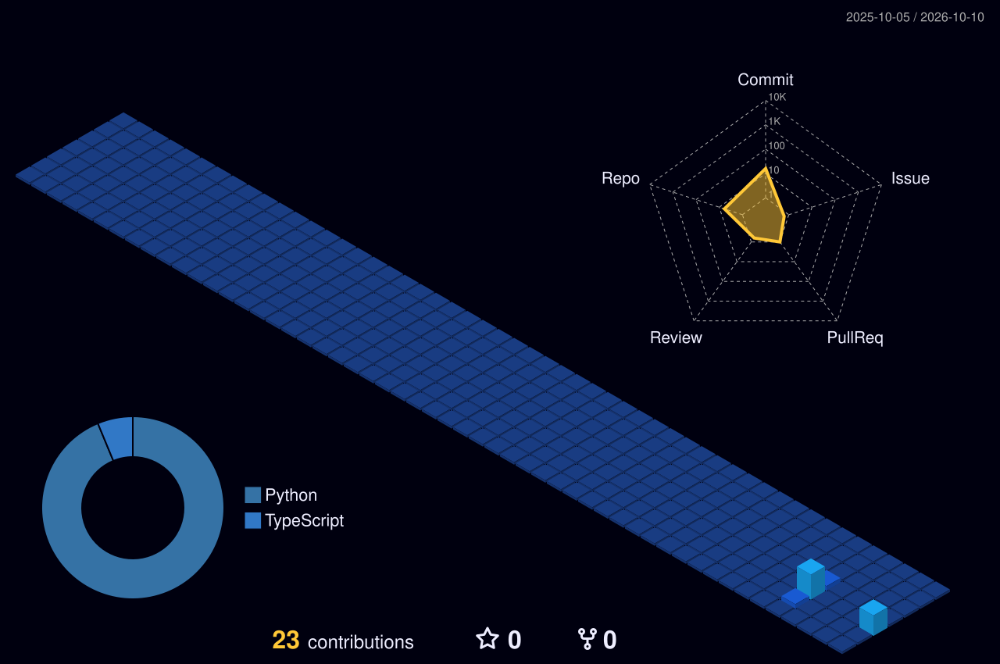

## `00'` &nbsp;Kick-off

Hey, I'm **Aarav** 👋 — a developer from **India 🇮🇳** who plays code like a **left winger**: take on the defender, beat them with a bit of skill, then put the ball in the net.

I learn by doing. I start projects, break them, fix them and ship them, and every bug is just another defender to get past. Right now I'm working mostly in **Python** and **JavaScript**, and I build anything that makes me ask *"wait, how does that actually work?"*

- 🛠️ **Current club:** on the **Web Dev team** at **Nexus — MUJ chapter**, building for the web with the squad
- ⚽ **Style of play:** simple passes, clean commits, and a bit of flair when it counts
- 🎯 **This season:** finish more projects than I start, and concede fewer goals to Bugs FC
- 🧠 **In training:** sharper debugging, cleaner code, and the next language on the list
- 🇧🇷 **Off the pitch:** watching Neymar clips at 2 AM and calling it "research"

> *"Play with flair. Ship with style."*

 

⏱️ <b>Quick question… who's winning?</b> &nbsp;(click for the result)

 

> **Me. Always in stoppage time.**
>
> The bugs score first, every single match — NullPointer, off-by-one, merge conflicts. Doesn't matter. The winner always comes at **90+4'**. Keep scrolling for the stats. ↓

## `15'` &nbsp;Team sheet

Every position tells you something different. Tap one.

🟢 &nbsp;<b>Starting XI</b> — what I play with every day

 

| Position | Player | Role on the pitch |
|:--|:--|:--|
| 🧤 Keeper | **Git** | Keeps a clean sheet. Saves me when I break everything. |
| 🛡️ Defence | **Python** | Solid, reliable, reads the game. |
| ⚙️ Midfield | **JavaScript** | Runs the whole show — links everything together. |
| ⚡ Wing | **HTML & CSS** | All the flair. The bit everyone actually sees. |

🔵 &nbsp;<b>Training ground</b> — what I'm working on right now

 

- Building small projects end-to-end and shipping them, not just starting them
- Getting sharper at debugging — fewer goals conceded to Bugs FC
- Writing cleaner code: simple passes over hero balls

🔴 &nbsp;<b>Transfer targets</b> — what I want to learn next

 

- React and building proper web apps
- Backend + APIs, so the whole team plays together
- Contributing to open source — playing in the bigger leagues

 

## `45'` &nbsp;Half-time stats

## `75'` &nbsp;The dribble

<picture>
  <source media="(prefers-color-scheme: dark)" srcset="https://raw.githubusercontent.com/Aaravcodesss/Aaravcodesss/output/pitch-dribble-dark.svg">
  
</picture>

⚽ The ball weaves through a whole season of commits — refreshed every 12 hours.

📐 <b>Tactical replay</b> &nbsp;(the same season, in 3D)

 

## `90'` &nbsp;Full-time

**Fancy a game? Building something fun?**

  

The pitch, the scoreboard and the crowd are all drawn in code (<a href="scripts/stadium.py">scripts/stadium.py</a>) — the move replays, the bugs keep scoring, the wave never stops. &nbsp;·&nbsp; FT: Aarav 4 – 3 Bugs FC

