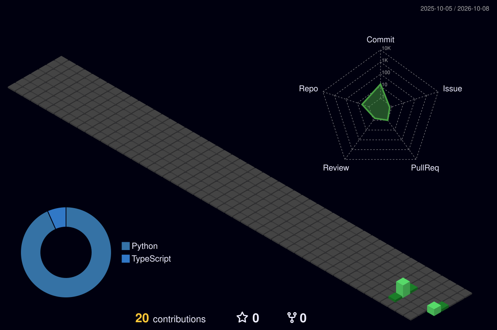

<div align="center">



<a href="https://github.com/Aaravcodesss">
  
</a>


</div>


## 🏟️ The Player

<table>
<tr>
<td width="38%" align="center">
  
</td>
<td width="62%">

```yaml
name:      Aarav
club:      Code FC ⚽
position:  Left wing dev · Neymar fan 🇧🇷
base:      India 🇮🇳
style:     Flair first — step-overs, rainbow flicks, clean commits
currently: Training hard, learning new tricks every matchday
ask_me:    Code, football, or best skill moves ✨
motto:     "Play with flair. Ship with style."
```

</td>
</tr>
</table>


## 🧰 Starting XI (Tech Stack)

<div align="center">
  
</div>


## 📊 Match Stats

<div align="center">
  
  
  <br/>
  
  <br/>
  
</div>


## 🧊 3D Stadium (Contribution Graph)

<div align="center">
  
</div>

## ⚽ The Dribble

<div align="center">
  <picture>
    <source media="(prefers-color-scheme: dark)" srcset="https://raw.githubusercontent.com/Aaravcodesss/Aaravcodesss/output/pitch-dribble-dark.svg"/>
    
  </picture>
</div>


<div align="center">

### 📣 Full-time whistle — thanks for visiting the stadium!


</div>
